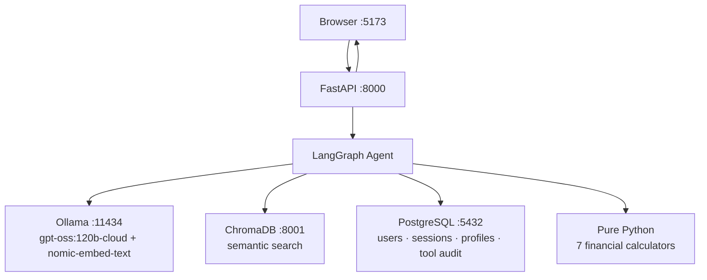

# Retirement Assistant

A RAG-powered agentic chatbot that helps UK users understand their retirement options through educational, factual pension guidance.

---

## What it Does

- **Username authentication** — simple username-only login; account created automatically on first register
- **RAG document search** — semantic search over ingested pension PDF documents using ChromaDB and nomic-embed-text embeddings
- **LangGraph agent with 11 tools** — orchestrates retrieval, financial calculations, profile management, and clarifying questions
- **Deterministic financial calculators** — projected pot, drawdown income, savings needed, shortfall, readiness score, inflation-adjusted goal
- **UK state pension info** — eligibility age, annual amount, years until eligible
- **Multi-turn chat** — full conversation history persisted to PostgreSQL with MemorySaver checkpointing
- **Activity panel** — right-side panel showing every tool call (with args and results) and document sources for each response
- **Admin PDF upload** — drag-and-drop PDF ingestion through the Admin page; documents indexed into ChromaDB automatically

---

## Architecture



---

## Tech Stack

| Layer | Technology |
|---|---|
| Frontend | React 18 + Vite 5 + Tailwind CSS v3 + JSX + TypeScript |
| Backend | FastAPI + Python 3.12 + LangGraph + LangChain |
| LLM | Ollama — gpt-oss:120b-cloud |
| Embeddings | nomic-embed-text (via Ollama) |
| Vector DB | ChromaDB |
| Relational DB | PostgreSQL 16 |
| Package managers | uv (backend) + npm (frontend) |
| Containers | Docker Compose |

---

## Service Ports

| Service | Port |
|---|---|
| Frontend | 5173 |
| Backend | 8000 |
| ChromaDB | 8001 |
| PostgreSQL | 5432 |
| pgAdmin | 5050 |
| Ollama (host) | 11434 |

---

## Prerequisites

- **Docker Desktop** — [https://www.docker.com/products/docker-desktop](https://www.docker.com/products/docker-desktop)
- **Ollama** — install via Homebrew:
  ```bash
  brew install ollama
  ```
- Pull both required models:
  ```bash
  ollama pull gpt-oss:120b-cloud
  ollama pull nomic-embed-text
  ```

---

## How to Run

### Docker (Recommended)

```bash
# 1. Start Ollama on the host
ollama serve

# 2. Start all services
docker compose up --build

# 3. Open the app
open http://localhost:5173
```

**Full reset** (removes containers, volumes, and rebuilt images — use if you want a clean slate):

```bash
docker compose down -v --rmi local && docker compose up --build
# -v          removes named volumes (wipes the PostgreSQL database and ChromaDB)
# --rmi local removes images built by this compose file, forcing a full rebuild
```

### Locally (No Docker)

Run each command in a separate terminal tab:

```bash
# Tab 1 — Ollama (always on Mac host)
ollama serve

# Tab 2 — PostgreSQL + ChromaDB only (still uses Docker)
docker compose up db chroma

# Tab 3 — Backend
cd backend
cp ../.env.example .env   # then edit DATABASE_URL to use localhost
uv sync
uv run uvicorn app.main:app --reload --port 8000

# Tab 4 — Frontend
cd frontend
npm install
npm run dev
```

---

## Project Structure

```
Retirement-Assistant/
├── backend/          FastAPI app, LangGraph agent, PostgreSQL, ChromaDB
├── frontend/         React 18 + Vite + Tailwind SPA
├── docker-compose.yml
├── .env.example
└── README.md
```

See [backend/README.md](backend/README.md) for detailed backend docs and [frontend/README.md](frontend/README.md) for frontend docs.

---

## API Reference

Full details in [backend/README.md](backend/README.md). Quick summary:

| Method | Path | Description |
|---|---|---|
| GET | /health | Health check — returns model name |
| POST | /auth/login | Log in with username; 404 if not found |
| POST | /auth/register | Create account; 409 if username taken |
| GET | /auth/me | Return user details by user_id query param |
| GET | /users/{id}/profile | Get saved financial profile |
| PUT | /users/{id}/profile | Update one or more profile fields |
| POST | /chat | Send a message; returns reply + tool calls + sources |
| GET | /sessions | List sessions for a user |
| GET | /sessions/{id}/tool-calls | Tool call history for a session |
| DELETE | /sessions/{id} | Delete session and all messages |
| POST | /admin/documents | Upload a PDF for ingestion |
| GET | /admin/documents | List all ingested documents |
| DELETE | /admin/documents/{id} | Remove document from ChromaDB, DB, and disk |

---

## Agent Tools

| Tool | Purpose |
|---|---|
| search_pension_documents | Semantic search over ingested pension PDFs |
| get_user_profile | Retrieve stored financial profile for the user |
| update_user_profile | Persist a confirmed financial detail to the profile |
| calculate_projected_pot | Future pension pot value using compound growth formula |
| calculate_drawdown_income | Annual income from drawdown + state pension |
| calculate_monthly_savings_needed | Monthly contributions needed to reach a target pot |
| calculate_shortfall | Gap between income goal and projected income |
| calculate_readiness_score | 0–100 score with label (On track / Needs attention / At risk) |
| calculate_inflation_adjusted_goal | Inflation-uplifted version of an income goal |
| get_uk_state_pension_info | State pension amount (£11,502/yr), eligibility age, years until eligible |
| ask_human | LangGraph interrupt — pauses agent to ask user a clarifying question |

---

## Database Schema

| Table | Purpose |
|---|---|
| users | Username + created_at |
| login_events | Timestamp log of every login |
| user_profiles | Financial profile fields (age, pot, income goal, etc.) |
| sessions | Chat session metadata (title, timestamps) |
| messages | Individual messages within a session |
| tool_calls | Audit log of every tool invocation and result |
| calculations | Persisted calculator inputs and outputs |
| documents | Metadata for ingested PDF documents |

---

## Service Credentials

**PostgreSQL**
- Host: `localhost:5432`
- Database: `retirement_db`
- User: `retirement`
- Password: `retirement`

**pgAdmin**
- URL: [http://localhost:5050](http://localhost:5050)
- Email: `admin@example.com`
- Password: `admin`

**ChromaDB**
- URL: [http://localhost:8001](http://localhost:8001)

---

## Environment Variables

Copy `.env.example` to `.env` before running locally.

| Variable | Description |
|---|---|
| `DATABASE_URL` | PostgreSQL async connection string (asyncpg) |
| `CHROMA_HOST` | ChromaDB hostname (default: `chroma` in Docker, `localhost` locally) |
| `CHROMA_PORT` | ChromaDB port (default: `8001`) |
| `OLLAMA_BASE_URL` | Ollama server URL (default: `http://host.docker.internal:11434`) |
| `OLLAMA_MODEL` | LLM model name (default: `gpt-oss:120b-cloud`) |
| `OLLAMA_EMBED_MODEL` | Embedding model name (default: `nomic-embed-text`) |
